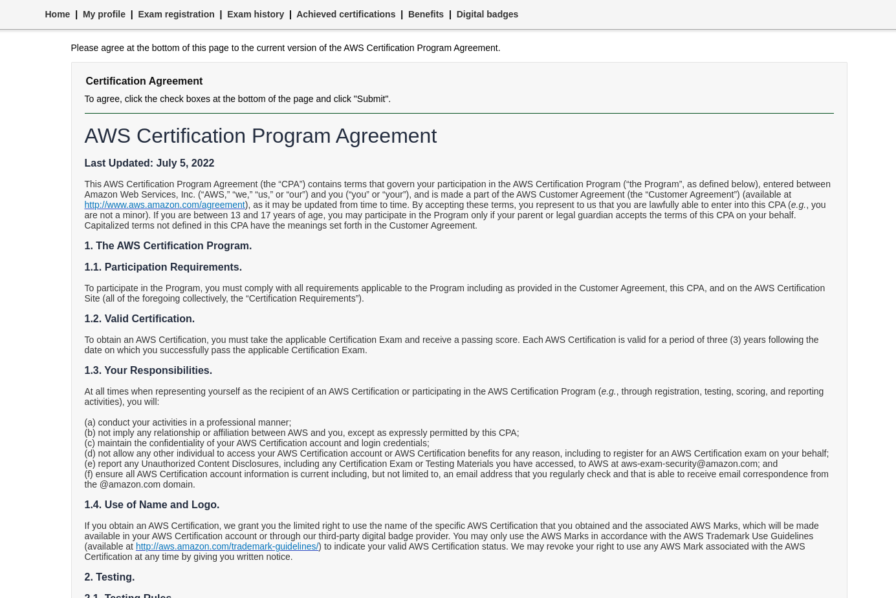
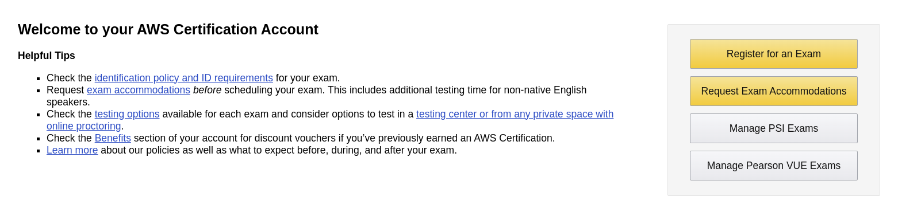
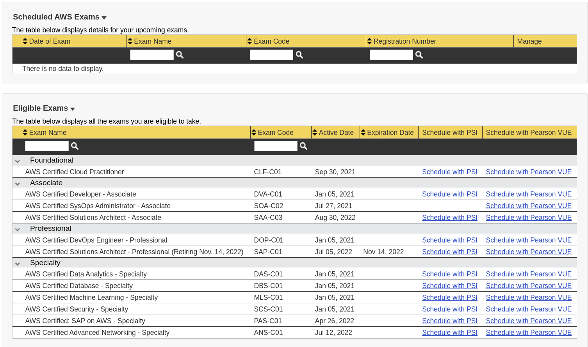
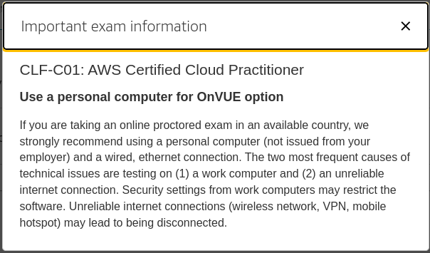
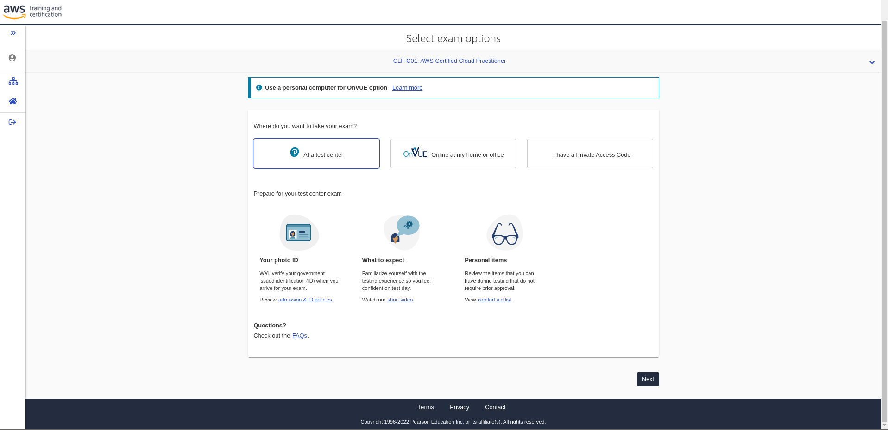
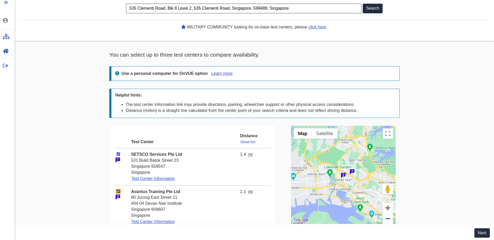
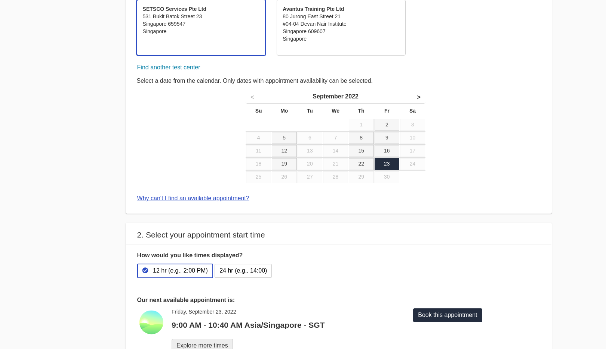
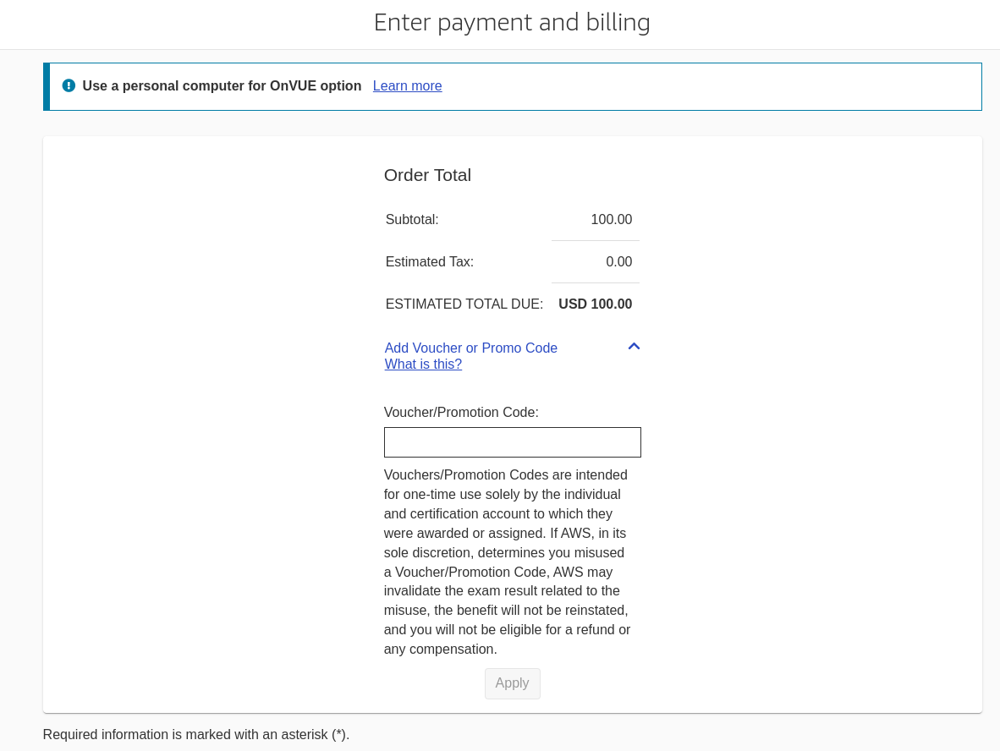

# AWS Certified Cloud Practitioner Bootcamp

## 1. Exam Overview

The [AWS Cloud Practitioner Exam](https://aws.amazon.com/certification/certified-cloud-practitioner/) validates cloud fluency and foundational AWS knowledge.  

[Exam Pricing](https://aws.amazon.com/certification/policies/before-testing/#Exam_pricing) USD100 as at Sep 2022.

The AWS Certified Cloud Practitioner is a foundational certificate:

[Exam Guide](https://d1.awsstatic.com/training-and-certification/docs-cloud-practitioner/AWS-Certified-Cloud-Practitioner_Exam-Guide.pdf) Details the different domains tested, weightage and terminonolgies which might be tested.

[Sample Questions](https://d1.awsstatic.com/training-and-certification/docs-cloud-practitioner/AWS-Certified-Cloud-Practitioner_Sample-Questions.pdf) Be familiar with the types of questions that will be asked.  Besides knowing why each correct answer is correct, know why each wrong answer is wrong.  

## 2. Voucher Logistics

You will be issued a 50% discount voucher to attempt the certification.  Please look out for it in your email (or spam folder).

Refer to this [link](https://docs.google.com/document/d/1Zfh0UThVyRkBSZZzVM_hJm3XucDMC_l-80VUSA0gbhE/edit?usp=sharing) for additional information regarding the voucher.

The voucher is only valid for PearsonVue test centers, be sure to choose that instead of PSI.  See section 3 below.

## 3. Registering For Your Exam

i. Create and account at [aws.training](https://www.aws.training/)

ii. Create an [AWS Certification account](https://www.aws.training/Certification).

iii. Login to your certification account. You may be asked to agree to the AWS Certification Program Agreement:

iv. After agreeing to the T&Cs, you will be shown a dashboard similar to the one below:

v. Click on "Schedule Exams" to continue:

vi. Select PearsonVue for AWS Certified Cloud Practitioner option as your vouchers are only valid for PearsonVue.  You will be redirected to the PearsonVue site.  Note that there is actually an online proctored exam option, however that is not encouraged:

vii. Select "At a test center" (recommended), after which you will be prompted to select exam language and presented with exam T&Cs:

viii. Select your test center and check test date availability, you can search for test centers near you:

ix. Select your preferred Date and Time:

x. At checkout, this is the place that you can enter your voucher code:

## 4. AWS Academy Resources

i. AWS Academy Cloud Foundation

ii. [AWS Academy Cloud Architecting](https://awsacademy.instructure.com/courses/25499)

iii. [AWS Learner Lab](https://awsacademy.instructure.com/courses/25746)

## 5. Additional Resources

i. [AWS Documentation](https://docs.aws.amazon.com/) Find out authorative details of the various AWS services.

ii. [AWS certified cloud practitioner exam guide build your cloud computing knowledge and build your skills as an AWS certified Cloud Practitioner (CLF-C01)](https://lyclibtnc.azurewebsites.net/?url=https://ebookcentral.proquest.com/lib/np/detail.action?docID=6843038) Exam Guide (e-Book)

iii. [AWS SkillsBuilder](https://explore.skillbuilder.aws/learn) Plenty of free learning resources.

iv. [AWS Certified Cloud Practitioner Official Practice Question Set on AWS skillsbuilder](https://explore.skillbuilder.aws/learn/course/external/view/elearning/12483/aws-certified-cloud-practitioner-practice-question-set-clf-c01-english)

v. [AWS Workshops](https://workshops.aws/)

## 6. SoE Specifics

For SoE students, refer to this [document](https://docs.google.com/document/d/1Rvdm3mQcxuglpftlvNM9z-h2xkTSxNJg_QxaxFAk_HI/edit?usp=sharing) for additional instructions.

## 7. Miscellaneous

Please keep me updated of your certification attempts.  Good luck.